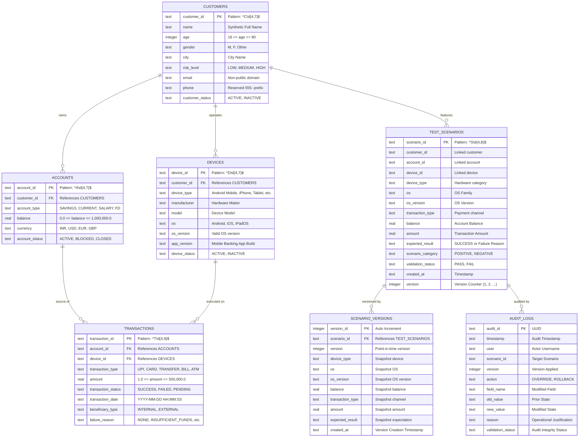

# Privacy-Safe Synthetic Test Data Generator for Mobile Banking

A comprehensive, production-ready system for synthesizing privacy-safe, statistically authentic test data for multi-device mobile banking applications.

---

## 🎯 Problem Statement
Mobile banking QA engineering teams spend up to 70% of testing cycles manually generating valid test datasets. Naive random generation introduces referential integrity errors, impossible device-OS configurations (e.g., iPhone running Android), and flat uniform transaction distributions that fail to stress-test real-world banking edge cases. This system completely automates the pipeline with zero Personally Identifiable Information (PII) leakage.

---

## 🚀 Key Features

1. **Pydantic v2 Schema Validation Engine**
   - Type-safe data models (`CustomerModel`, `AccountModel`, `DeviceModel`, `TransactionModel`, `ScenarioModel`).
   - Automated boundary checking, enum constraints, and cross-field compatibility enforcement.
   - Built-in rejection of real email domains (`@gmail.com`) and invalid telephone numbers.

2. **Advanced Statistical Distribution Engine**
   - **Pareto Power-Law Model ($\alpha=1.8, x_m=10.0$):** Replicates realistic UPI / IMPS micropayments where >80% of volume is under ₹500 with a heavy high-value tail.
   - **Log-Normal Model ($\mu=6.2, \sigma=1.35$):** Emulates merchant POS and debit card retail spending.
   - **Truncated Gaussian Model:** Simulates utility bill payments and standard denomination ATM cash withdrawals.
   - **Diurnal Bimodal Gaussian Mixture:** Generates realistic temporal load profiles with peaks at midday (1:30 PM) and evening (7:30 PM).

3. **Domain Business Logic & Referential Integrity**
   - Enforces business rules: `ACCOUNT_BLOCKED`, `ACCOUNT_CLOSED`, `INSUFFICIENT_FUNDS`, `INVALID_AMOUNT`.
   - AST-compiled condition evaluations with in-memory caching for sub-second generation.
   - Zero orphaned records: all transactions map to active accounts, and accounts map to valid customer profiles.

4. **Multi-Device Compatibility Matrix**
   - Hardware-to-OS verification covering iPhone (iOS 16–18), Android Mobile (Android 11–15), Tablets, and Low-end Android devices.

5. **Operational Reliability Features**
   - **Audit Trail:** SQLite-backed immutable logging of human-in-the-loop manual overrides.
   - **Rollback Manager:** Point-in-time recovery to previous scenario versions.
   - **Legacy CSV Migration:** Ingestion pipeline migrating legacy unvalidated test CSVs with automatic backup snapshots.
   - **Experimental Benchmarking:** Quantitative comparison proving proposed generator delivers 100% validity vs. ~25% on naive random baselines.

---

## 🗄️ Relational Database Schema & Architecture

The operational data store is built on **SQLite 3** (`data/synthetic_data.db`), initialized via `database/schema.sql`.

### Entity-Relationship Diagram (ERD)



---

## 🔌 Programmatic Interfaces & API Endpoints

The generator modules expose clean Python API endpoints designed for automated QA workflows, CI/CD integration, and test harness scripting:

### 1. Synthetic Generator API (`generator.synthetic_generator.SyntheticGenerator`)
```python
from generator.synthetic_generator import SyntheticGenerator

# Initialize generator with optional seed for deterministic reproducibility
gen = SyntheticGenerator(seed=42)

# Generate complete relational dataset across all entities
# Supported distributions: 'pareto', 'lognormal', 'gaussian', 'uniform'
dataset = gen.generate_dataset(n_scenarios=1000, distribution_model="pareto")

# Returns dictionary:
# {
#   'customers': [...],
#   'accounts': [...],
#   'devices': [...],
#   'transactions': [...],
#   'scenarios': [...]
# }
```

### 2. Pydantic Batch Validation API (`validation.schema_validator.validate_dataset_pydantic`)
```python
from validation.schema_validator import validate_dataset_pydantic

# Validate all tables against strict Pydantic v2 boundary models
summary = validate_dataset_pydantic(dataset)

print(summary['is_fully_valid'])   # True
print(summary['valid_entities'])   # Total valid entities validated
print(summary['table_metrics'])    # Metrics per entity table
```

### 3. Business Rule Validation API (`validation.business_validator.validate_business_rules`)
```python
from validation.business_validator import validate_business_rules

context = {
    'account_status': 'ACTIVE',
    'amount': 25000.0,
    'balance': 500.0,
    'device_type': 'Android Mobile',
    'os_version': 'Android 14'
}

result = validate_business_rules(context)
# Returns:
# {
#   'is_valid': False,
#   'violated_rules': ['RULE_3'],
#   'expected_status': 'FAILED',
#   'expected_failure_reason': 'INSUFFICIENT_FUNDS'
# }
```

### 4. Manual Override & Rollback API (`rollback.version_manager.VersionManager`)
```python
from rollback.version_manager import VersionManager

# Apply human-in-the-loop manual override with audit logging
success = VersionManager.create_new_version(
    scenario_id="S000001",
    field_name="amount",
    new_value=99999.0,
    user="qa_engineer_1",
    reason="Stress-test high value overdraft rejection"
)

# Rollback scenario to previous version
restored = VersionManager.rollback_to_version(
    scenario_id="S000001",
    version=1,
    user="qa_lead",
    reason="Reverting to baseline generated scenario"
)
```

### 5. Legacy CSV Ingestion API (`legacy.legacy_migrator.LegacyMigrator`)
```python
from legacy.legacy_migrator import LegacyMigrator

# Ingest, preserve .bak snapshot, and migrate legacy CSV to normalized schema
output_path, backup_path = LegacyMigrator.migrate("data/legacy_test_data.csv")
```

---

## 🛠️ Technology Stack
- **Language & Runtime:** Python 3.11+
- **Schema & Validation:** Pydantic v2
- **Data Synthesis & Math:** Faker, NumPy, SciPy, Pandas
- **Storage & Audit:** SQLite 3
- **Frontend / UI:** Streamlit (Glassmorphic dark-mode UI with Plotly analytics)
- **Testing & Verification:** Pytest

---

## 📦 Installation & Setup

```bash
# Clone the repository
git clone https://github.com/vasanth-art2006/coe-project.git
cd "coe-project/synthetic-test-data-generator"

# Install dependencies
pip install -r requirements.txt
```

---

## 🖥️ Running the Application

Launch the Streamlit web dashboard:
```bash
streamlit run app.py
```
Access the application in your browser at `http://localhost:8501`.

---

## 🧪 Automated Test Suite & Error Boundaries

Run the full automated test suite:
```bash
pytest tests/ -v
```

### ✅ Test Suite Results
- **68/68 Tests Passing (100% Pass Rate in ~0.94s)**
  - Detailed technical documentation on all error boundaries, failure inflection points ($x \pm \epsilon$), and Pytest harnesses is available in [`docs/unit_testing_and_error_boundaries.md`](synthetic-test-data-generator/docs/unit_testing_and_error_boundaries.md).

---

## 📊 Performance Metrics
- **Generation Speed:** 10,000 complete multi-table scenarios generated in **~0.47 seconds** (exceeding the 10-second requirement).
- **Validity Rate:** **100.0%** schema & business validity on proposed generator vs. **24.2%** on naive baseline.
- **Privacy Assurance:** Zero real PII; 100% synthetic namespaces (`@synthetic-test.local`, 555-prefix telephony).
