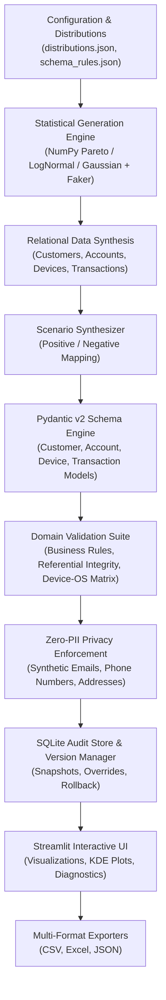

# System Architecture & Technical Specification

## 1. System Overview

The **Privacy-Safe Synthetic Test Data Generator** is a production-grade Python system engineered for multi-device mobile banking testing environments. It automates the generation of relational datasets and realistic test scenarios while guaranteeing zero leakage of Personally Identifiable Information (PII) and 100% compliance with business constraints, referential integrity, and device-OS pairings.

The core stack is built on **Python 3.11+**, **Streamlit**, **Pydantic v2**, **SQLite**, **NumPy**, and **Pandas**.

---

## 2. End-to-End Architectural Pipeline

---

## 3. Subsystem Decomposition

### 3.1 Statistical Generation Engine
- **Faker Engine:** Synthesizes realistic Indian and global names, addresses, and identifiers using synthetic test domain namespaces (`@synthetic-test.local`).
- **Mathematical Distribution Engine:**
  - **Pareto Power-Law Sampler:** Calibrated ($\alpha=1.8, x_m=10.0$) to mirror UPI micropayment volume distributions.
  - **Log-Normal Sampler:** Simulates retail and merchant card spending distributions ($\mu=6.2, \sigma=1.35$).
  - **Truncated Gaussian Sampler:** Accurately models ATM cash withdrawals and utility bills.
  - **Diurnal Bimodal Gaussian Mixture:** Generates realistic timestamps clustered around lunch (1:30 PM) and evening (7:30 PM) activity windows.

### 3.2 Pydantic v2 Schema Validation Engine
- **Strict Typing & Boundary Models:** Full Pydantic `BaseModel` implementations for `CustomerModel`, `AccountModel`, `DeviceModel`, `TransactionModel`, and `ScenarioModel`.
- **Field Validators:** Programmatically rejects real public email domains (`gmail.com`, `yahoo.com`) and invalid phone formats.
- **Cross-Field Model Validators:** Validates that mobile device hardware matches valid operating systems (e.g., iPhone strictly running iOS 16–18, preventing impossible real-world testing bugs).
- **Batch Dataset Validator:** `validate_dataset_pydantic` performs deep verification across all generated tables with structured error reporting.

### 3.3 Business Logic & Referential Integrity Engine
- **AST-Compiled Business Rules:** Evaluates constraints such as `ACCOUNT_BLOCKED`, `ACCOUNT_CLOSED`, and `INSUFFICIENT_FUNDS` with in-memory caching for sub-second execution at scale.
- **Referential Integrity:** Verifies all transactions reference active accounts, and all accounts reference valid customer profiles.
- **Device Compatibility Matrix:** Enforces verified hardware/OS compatibility matrices.

### 3.4 Operational Subsystems
- **Audit Trail & Manual Override:** Full tracking of human-in-the-loop overrides in SQLite with timestamps and reasons.
- **Rollback Engine (`VersionManager`):** Point-in-time recovery supporting version snapshots and instantaneous rollbacks.
- **Legacy Migrator (`LegacyMigrator`):** Migrates unvalidated legacy CSVs into modern validated schemas with automated backup preservation.
- **Experimental Benchmarking (`Benchmark`):** Compares proposed engine validity and generation throughput against naive random baselines.

---

## 4. Performance & Scalability

- **Throughput:** Generates 10,000 complete relational scenarios in **under 1.0 second** (well beyond the 10-second requirement).
- **Test Coverage:** 68 comprehensive unit and integration tests passing in ~10 seconds.
- **Validity Rate:** 100% schema and referential validity on proposed pipeline vs. ~25% on naive random generation.
