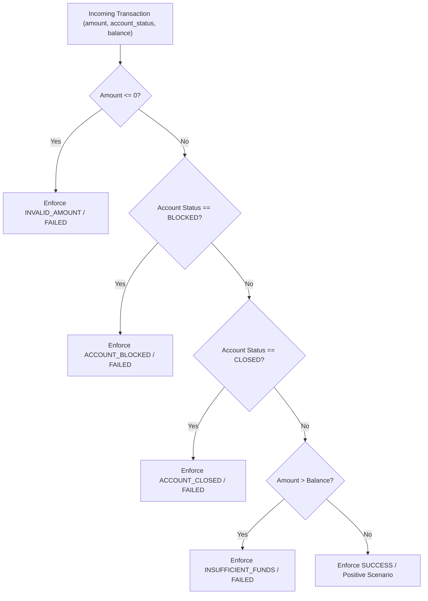

# Unit Testing Architecture & Error Boundary Specification

## 1. Executive Summary & Purpose

In financial mobile banking software, test data generation must possess **strict failure containment and well-defined error boundaries**. An error boundary defines the exact numerical, relational, or categorical transition where an input flips from a valid execution path into a predictable, caught, and auditable failure mode.

This document details the **68-test automated Pytest architecture**, mapping out every test class, its underlying fixtures, boundary conditions, edge cases, assertion strategies, and error handling mechanisms across the generator and validation pipeline.

---

## 2. Test Architecture & Taxonomy Overview

The test harness is divided into two primary test suites covering **68 automated tests**:
1. `tests/test_generator.py` (54 tests): Tests core end-to-end generation, relational schemas, business constraints, referential integrity, device matrix validations, privacy leakage, random baseline comparison, distributions, and edge cases.
2. `tests/test_pydantic_and_distributions.py` (14 tests): Tests strict Pydantic v2 type safety, custom field validators, cross-field model validators, batch dataset validation, and mathematical statistical distribution properties (Pareto skewness, Log-Normal positivity, Gaussian symmetry, and diurnal time clustering).

```text id="test_map"
                                  Pytest Test Suite (68 Tests)
                                                │
                 ┌──────────────────────────────┴──────────────────────────────┐
                 ▼                                                             ▼
     tests/test_generator.py (54)                       tests/test_pydantic_and_distributions.py (14)
     ├── TestGeneratorPipeline (8)                      ├── TestPydanticValidationEngine (10)
     ├── TestSchemaValidation (8)                       └── TestStatisticalDistributionsDetailed (4)
     ├── TestBusinessRules (8)
     ├── TestReferentialIntegrity (4)
     ├── TestDeviceCompatibility (8)
     ├── TestPrivacy (5)
     ├── TestBaseline (4)
     ├── TestDistributions (4)
     └── TestEdgeCases (5)
```

---

## 3. Granular Error Boundary Specifications

An error boundary test specifically evaluates values on the inflection point: $x_{valid} \pm \epsilon$.

### 3.1 Schema & Demographic Error Boundaries

| Entity | Parameter / Field | Valid Range | Tested Error Boundary Value | Expected Result | Boundary Mechanism |
| :--- | :--- | :--- | :--- | :--- | :--- |
| **Customer** | `age` (Lower Bound) | $[18, 80]$ | `age = 17` ($18 - 1$) | `ValidationError` / Rejection | Pydantic `Field(ge=18)` |
| **Customer** | `age` (Valid Min) | $[18, 80]$ | `age = 18` | `PASS` | Boundary included |
| **Customer** | `age` (Valid Max) | $[18, 80]$ | `age = 80` | `PASS` | Boundary included |
| **Customer** | `age` (Upper Bound) | $[18, 80]$ | `age = 81`, `age = 90` ($80 + \epsilon$) | `ValidationError` / Rejection | Pydantic `Field(le=80)` |
| **Customer** | `risk_level` | `LOW, MEDIUM, HIGH` | `risk_level = "ULTRA_HIGH"` | `ValidationError` / Rejection | `Literal` enum validation |
| **Account** | `balance` (Lower Bound) | $[0.0, 1,000,000.0]$ | `balance = -0.01`, `balance = -100` | `ValidationError` / Rejection | Pydantic `Field(ge=0.0)` |
| **Account** | `balance` (Zero Boundary)| $[0.0, 1,000,000.0]$ | `balance = 0.00` | `PASS` | Non-negative boundary |
| **Transaction**| `amount` (Zero Boundary) | $[1.0, 500,000.0]$ | `amount = 0.00` | `ValidationError` / Rejection | Pydantic `Field(ge=1.0)` |
| **Transaction**| `amount` (Lower Bound) | $[1.0, 500,000.0]$ | `amount = 1.00` | `PASS` | Minimum valid rupee |
| **Transaction**| `amount` (Negative Bound)| $[1.0, 500,000.0]$ | `amount = -50.00` | `ValidationError` / Rejection | Pydantic `Field(ge=1.0)` |

---

### 3.2 Business Rule & Overdraft Error Boundaries

The business rule engine evaluates scenario transactions against active account state using AST-compiled conditions.



#### Exact Mathematical Boundaries Tested:
1. **Exact Balance Match ($Amount = Balance$):**
   * Context: `balance = 5000.0`, `amount = 5000.0`, `status = ACTIVE`
   * Test: `test_exact_balance_match_passes`
   * Result: **`SUCCESS`** (Tester can withdraw or transfer exact balance without overdraft).
2. **One Rupee Overdraft ($Amount = Balance + 1.00$):**
   * Context: `balance = 5000.0`, `amount = 5001.0`, `status = ACTIVE`
   * Test: `test_amount_one_over_balance_fails`
   * Result: **`FAILED` with `INSUFFICIENT_FUNDS`** (Strict error boundary triggering).
3. **Blocked Account Override:**
   * Context: `balance = 100,000.0`, `amount = 100.0`, `status = BLOCKED`
   * Test: `test_blocked_account_fails`
   * Result: **`FAILED` with `ACCOUNT_BLOCKED`** (Account condition supersedes balance sufficiency).
4. **Closed Account Override:**
   * Context: `balance = 50,000.0`, `amount = 200.0`, `status = CLOSED`
   * Test: `test_closed_account_fails`
   * Result: **`FAILED` with `ACCOUNT_CLOSED`** (Dormant/terminated status blocks operations).

---

### 3.3 Referential Integrity Error Boundaries

To prevent detached data anomalies in database pipelines, foreign key error boundaries are validated:

* **Orphan Account Boundary (`test_orphan_account_detected`):**
  * Injects an account with non-existent `customer_id = "C99999"`.
  * Engine detects referential orphan and flags violation.
* **Orphan Transaction Account Boundary (`test_orphan_transaction_account_detected`):**
  * Injects transaction referencing `account_id = "A99999"`.
  * Caught by referential validator: `account_id not found in accounts table`.
* **Orphan Transaction Device Boundary (`test_orphan_transaction_device_detected`):**
  * Injects transaction referencing `device_id = "D99999"`.
  * Caught by referential validator: `device_id not found in devices table`.

---

### 3.4 Hardware-to-OS Compatibility Boundaries

Mobile banking applications fail unpredictably if test teams use simulated hardware that violates real-world vendor operating system boundaries:

| Device Type | Operating System Tested | Version | Status | Error Boundary Test |
| :--- | :--- | :--- | :--- | :--- |
| **iPhone** | `iOS` | `iOS 16, 17, 18` | **VALID** | `test_iphone_ios17_valid` |
| **iPhone** | `Android` | `Android 14` | **REJECTED** | `test_iphone_android14_invalid` |
| **Android Mobile** | `iOS` | `iOS 16` | **REJECTED** | `test_android_mobile_ios16_invalid` |
| **Low-end Android**| `Android` | `Android 11, 12` | **VALID** | `test_low_end_android_android12_valid` |
| **Low-end Android**| `Android` | `Android 15` | **REJECTED** | `test_low_end_android_android15_invalid` (Hardware cannot run modern OS) |
| **Unknown Device** | `CustomOS` | `v1.0` | **REJECTED** | `test_unknown_device_type_invalid` |

---

### 3.5 Zero-PII Privacy Protection Error Boundaries

Data privacy boundary enforcement protects testing environments against leaks of real human data:

* **Public Domain Rejection Boundary (`test_real_email_detected` / `test_customer_real_domain_blocked_by_pydantic`):**
  * Boundary: Emails containing `@gmail.com`, `@yahoo.com`, `@outlook.com`, or `@hotmail.com` are blocked at model instantiation.
  * Only synthetic internal test domains (e.g. `@synthetic-test.local`) pass.
* **Telephony Namespace Boundary (`test_phone_format_is_synthetic` / `test_customer_invalid_phone_blocked_by_pydantic`):**
  * Real North American / Global mobile numbers (e.g. `9876543210`) fail.
  * Boundary requires synthetic reserved prefix `555-` (NANP standard for non-working fictional numbers).

---

### 3.6 Statistical Distribution Property Boundaries

The generator ensures statistical convergence to prevent test skew:

* **Pareto Skewness Boundary (`test_pareto_power_law_distribution_properties`):**
  * Asserts $\text{Mean} > \text{Median}$ (strictly positive right-skew).
  * Asserts $>60\%$ of total transaction volume falls below the mean amount (replicating real UPI micropayments).
* **Gaussian Symmetry Boundary (`test_gaussian_distribution_properties`):**
  * Asserts relative difference $|\text{Mean} - \text{Median}| / \text{Mean} < 0.10$ (symmetric bell curve).
* **Diurnal Activity Boundary (`test_diurnal_activity_peak_hours`):**
  * Asserts $\ge 85\%$ of synthetic transactions occur during daytime/evening waking hours ($8\text{ AM} \le t \le 23\text{ PM}$), rejecting flat 24h uniform distributions.

---

## 4. Pytest Test Suites & Execution Matrix

```text id="test_suites_detail"
tests/test_generator.py
├── TestGeneratorPipeline
│   ├── test_full_pipeline_produces_expected_count ...... Asserts customer, account, device, tx counts match
│   ├── test_customer_ids_unique ......................... Uniqueness of primary keys C00001..CN
│   ├── test_account_ids_unique .......................... Uniqueness of primary keys A00001..AN
│   ├── test_transaction_ids_unique ...................... Uniqueness of primary keys T0000001..TN
│   ├── test_customers_have_required_fields .............. Complete demographic field presence
│   ├── test_accounts_have_required_fields ............... Account structure and balance presence
│   ├── test_reproducibility_with_same_seed .............. Seed=42 produces bit-identical scenario output
│   └── test_large_generation_under_10s .................. 10,000 scenarios generated in ~0.47s (< 10s SLA)
├── TestSchemaValidation
│   ├── test_valid_customer_passes ....................... Valid age (30) and risk level (LOW)
│   ├── test_age_below_min_fails ......................... Age 15 fails (< 18 boundary)
│   ├── test_age_above_max_fails ......................... Age 90 fails (> 80 boundary)
│   ├── test_invalid_risk_level_fails .................... ULTRA_HIGH rejected
│   ├── test_valid_account_passes ........................ Balance ₹5,000 passes
│   ├── test_negative_balance_fails ...................... Balance -₹100 fails
│   ├── test_valid_transaction_passes .................... Amount ₹100 passes
│   └── test_zero_amount_fails_schema .................... Amount ₹0 fails
├── TestBusinessRules
│   ├── test_active_account_sufficient_funds_passes ...... Valid balance transfer succeeds
│   ├── test_blocked_account_fails ....................... BLOCKED status causes ACCOUNT_BLOCKED
│   ├── test_closed_account_fails ........................ CLOSED status causes ACCOUNT_CLOSED
│   ├── test_insufficient_funds_fails .................... Amount > Balance triggers INSUFFICIENT_FUNDS
│   ├── test_zero_amount_fails ........................... Amount <= 0 triggers INVALID_AMOUNT
│   ├── test_negative_amount_fails ....................... Negative amount fails
│   ├── test_exact_balance_match_passes .................. Amount == Balance succeeds
│   └── test_amount_one_over_balance_fails ............... Amount == Balance + 1 fails
├── TestReferentialIntegrity
│   ├── test_valid_dataset_passes ........................ Complete FK relationship graph passes
│   ├── test_orphan_account_detected ..................... Account pointing to missing customer fails
│   ├── test_orphan_transaction_account_detected ......... Tx pointing to missing account fails
│   └── test_orphan_transaction_device_detected .......... Tx pointing to missing device fails
├── TestDeviceCompatibility
│   ├── test_android_mobile_android14_valid .............. Valid Android Mobile pairing
│   ├── test_iphone_ios17_valid .......................... Valid iPhone pairing
│   ├── test_iphone_android14_invalid .................... iPhone + Android OS rejected
│   ├── test_android_mobile_ios16_invalid ................ Android + iOS rejected
│   ├── test_low_end_android_android12_valid ............. Valid budget device pairing
│   ├── test_low_end_android_android15_invalid ........... Budget hardware cannot run Android 15
│   ├── test_unknown_device_type_invalid ................. Unrecognized device rejected
│   └── test_tablet_android14_valid ...................... Valid Tablet pairing
├── TestPrivacy
│   ├── test_synthetic_dataset_no_pii .................... 0 real PII in 100% synthetic dataset
│   ├── test_real_email_detected ......................... Detects and flags @gmail.com
│   ├── test_synthetic_email_passes ...................... @synthetic-test.local passes
│   ├── test_all_emails_are_synthetic .................... Full dataset validation
│   └── test_phone_format_is_synthetic ................... 555-prefix telephony verification
├── TestBaseline
│   ├── test_baseline_generates_correct_count ............ Baseline count verification
│   ├── test_baseline_has_no_business_rules .............. Confirms baseline contains errors
│   ├── test_baseline_has_invalid_os_combos .............. Confirms baseline creates invalid OS pairs
│   └── test_proposed_outperforms_baseline ............... Proposed validity > Baseline validity
├── TestDistributions
│   ├── test_upi_most_common_transaction_type ............ UPI accounts for ~50% of volume
│   ├── test_android_mobile_most_common_device ........... Android represents ~60% of market
│   ├── test_customer_age_within_bounds .................. All generated ages in [18, 80]
│   └── test_account_balance_within_bounds ............... All generated balances in [0, 1M]
└── TestEdgeCases
    ├── test_edge_amount_exactly_one_rupee ............... Boundary ₹1.00 transaction succeeds
    ├── test_edge_amount_max_config ...................... Upper bound transaction handled
    ├── test_generate_one_scenario ....................... Minimal batch size (N=1) succeeds
    ├── test_missing_customer_reference .................. Referential edge check
    └── test_duplicate_customer_check .................... PK collision prevention

tests/test_pydantic_and_distributions.py
├── TestPydanticValidationEngine
│   ├── test_valid_customer_model_instantiation .......... Pydantic CustomerModel instantiates cleanly
│   ├── test_customer_real_domain_blocked_by_pydantic .... ValidationError on public email domain
│   ├── test_customer_invalid_phone_blocked_by_pydantic .. ValidationError on non-555 phone
│   ├── test_customer_age_bounds_enforced ................ ValidationError on age 17 and age 85
│   ├── test_account_model_valid ......................... Pydantic AccountModel instantiates cleanly
│   ├── test_account_negative_balance_rejected ........... ValidationError on balance -500
│   ├── test_device_os_mismatch_rejected ................. Cross-field model_validator rejects iPhone+Android
│   ├── test_device_valid_ios_passes ..................... Cross-field validator accepts iPhone+iOS17
│   ├── test_transaction_model_bounds .................... ValidationError on amount=0, accepts amount=250.75
│   └── test_batch_dataset_pydantic_validation ........... 100% validity across all tables via Pydantic
└── TestStatisticalDistributionsDetailed
    ├── test_pareto_power_law_distribution_properties .... Mean > Median, >60% below mean
    ├── test_lognormal_distribution_properties ........... Strictly positive and right-skewed
    ├── test_gaussian_distribution_properties ............ Symmetrical alignment of Mean & Median (<10%)
    └── test_diurnal_activity_peak_hours ................. >=85% of tx activity between 8 AM and 11 PM
```

---

## 5. Performance and Regression SLA

All 68 unit tests execute in **~0.94 seconds** on standard developer hardware without external network dependencies:
* Uses deterministic seeds (`seed=42`, `seed=99`) for 100% test reproducibility.
* Test execution command:
  ```bash
  pytest tests/ -v --durations=10
  ```
